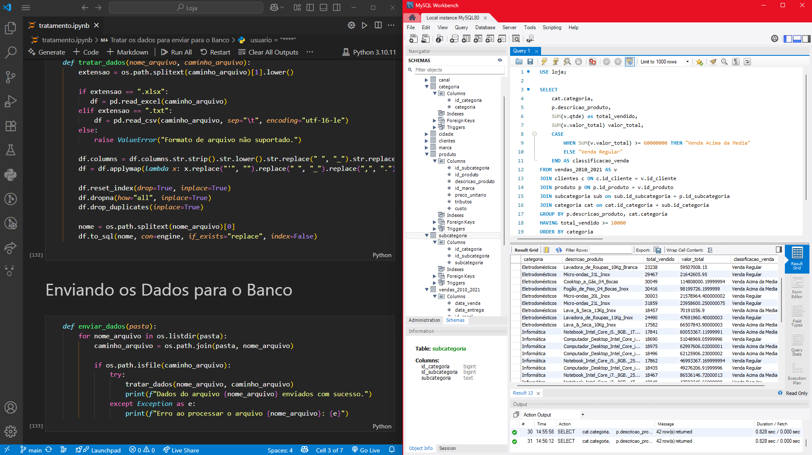
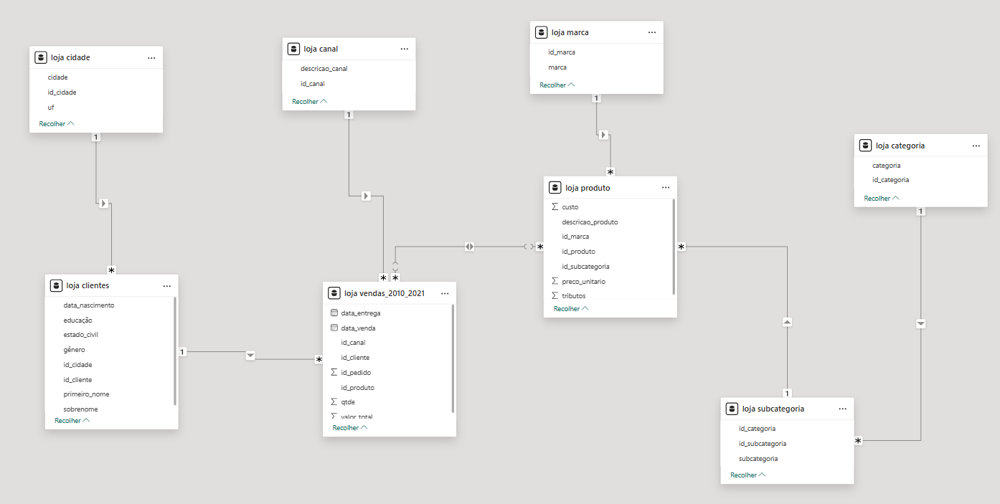
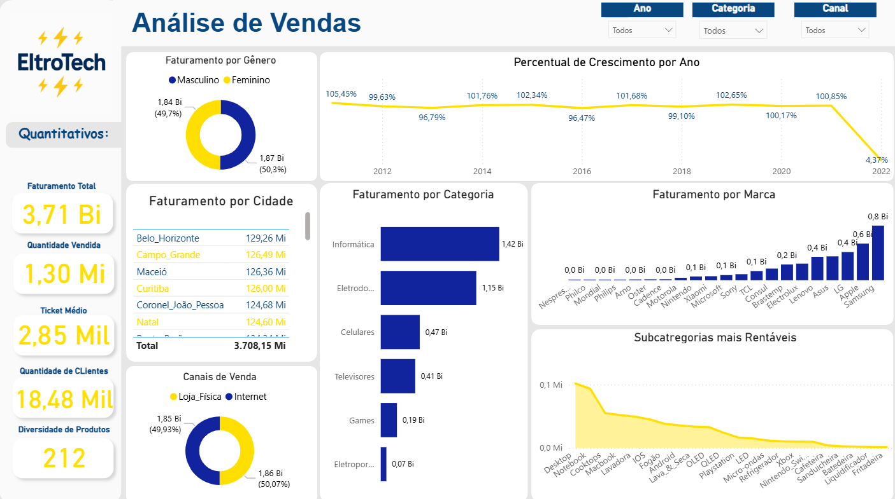

# ⚡ ELETROTECH — Pipeline de Dados com Python, MySQL e Power BI

Este projeto demonstra uma pipeline completa de dados, da ingestão à visualização, utilizando Python para o tratamento e carga dos dados, MySQL para o armazenamento e Power BI para a análise visual interativa.

---

## 🎯 Objetivo

Automatizar o fluxo de dados da empresa **ELETROTECH**, estruturando a base de informações com:

- 🐍 **Python** para realizar todo o processo de ETL;
- 🐬 **MySQL** para armazenar os dados em tabelas relacionais;
- 📊 **Power BI** para criação de dashboards analíticos.

---

## ⚙️ Tecnologias Utilizadas

- `Python 3.10+`
- `pandas`, `sqlalchemy`, `mysql-connector-python`
- `MySQL`
- `Power BI`
- Jupyter Notebook (`.ipynb`)

---

## 🗂️ Estrutura do Projeto

📁 ELETROTECH/  
├── dados/  
│   ├── Canal.xlsx  
│   ├── Categoria.xlsx  
│   ├── Cidade.xlsx  
│   ├── Clientes.txt  
│   ├── Marca.xlsx  
│   ├── Produto.xlsx  
│   ├── Subcategoria.xlsx  
│   └── vendas_2010_2021.xlsx  
│  
├── etl/  
│   └── etl_mysql.ipynb            
│  
├── imagens/  
│   ├── dashboard.png             
│   ├── integracao_python_mysql.png 
│   └── modelo_relacional.png      
│  
├── powerbi/  
│   └── Dashboard.pbix             
│  
└── README.md

---

## 🚀 Como Executar

1. **Clone o repositório:**
```bash
git clone https://github.com/seuusuario/eletrotech.git
cd eletrotech


2. **Instale os requisitos:**
```bash
pip install -r requirements.txt
```

3. **Execute o ETL:**

- Abra o arquivo `etl_mysql.ipynb` com Jupyter Notebook ou VS Code.
- Execute as células sequencialmente.
- As tabelas serão criadas automaticamente no MySQL e populadas com os dados da pasta `dados/`.

4. **Abra o Dashboard:**

- Vá até a pasta `powerbi/` e abra `Dashboard.pbix` no Power BI.
- Atualize a conexão com o banco de dados, se necessário.

---

## 🔗 Integração entre as tecnologias



---

## 🗃️ Modelo Relacional no MySQL



---

## 📊 Dashboard Power BI



---

## ✅ Resultados

- Pipeline de dados automatizada e replicável;
- Base de dados limpa, estruturada e armazenada no MySQL;
- Visualização clara e interativa no Power BI.

---

## 🧠 Aprendizados

- Processos ETL com Python + SQL;
- Criação dinâmica de tabelas no banco;
- Conexão de bases relacionais com ferramentas de BI.

---

